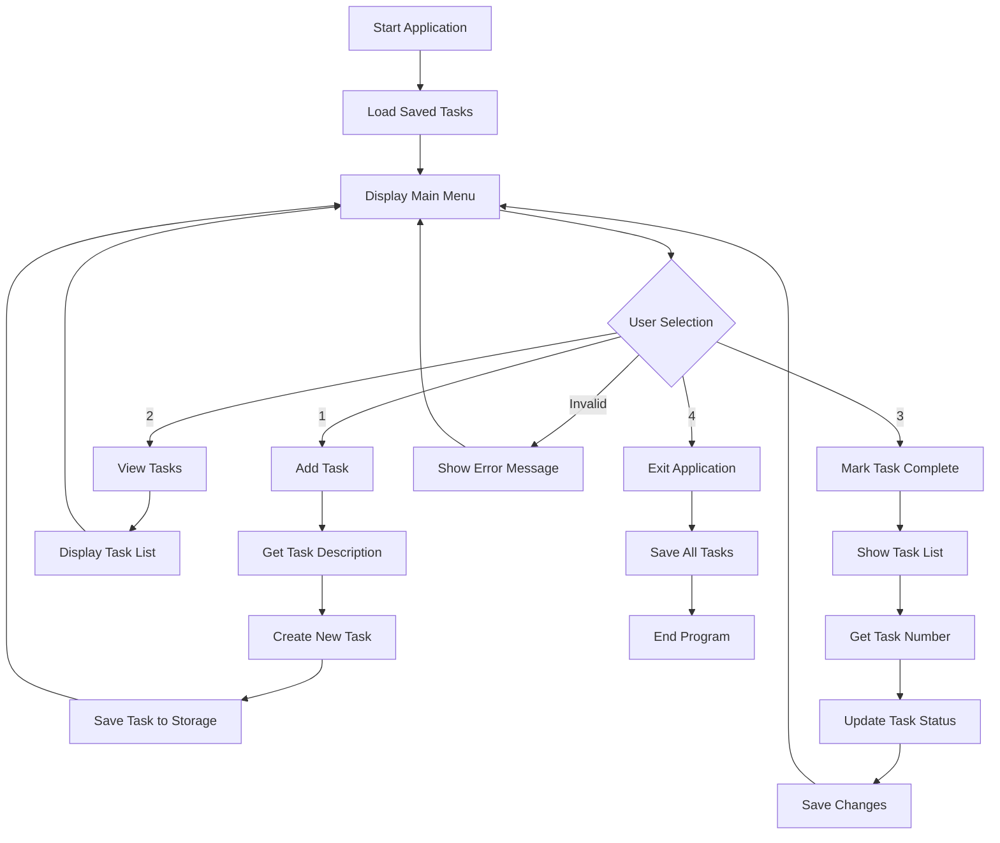
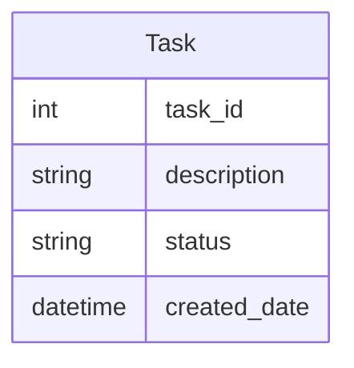
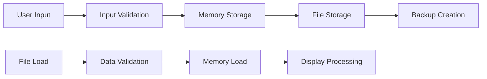

# Product Requirements Document (PRD)

# 1. INTRODUCTION

## 1.1 Purpose
This Software Requirements Specification (SRS) document provides a detailed description of the Simple To-Do List App. It serves as a comprehensive guide for developers, project stakeholders, and testers involved in the development process. The document outlines functional and non-functional requirements, constraints, and specifications necessary for successful implementation.

## 1.2 Scope
The Simple To-Do List App is a command-line application developed in Python that enables users to manage their daily tasks efficiently. The system will provide essential task management capabilities while maintaining simplicity and ease of use.

Key features include:
- Task creation with text descriptions
- Task status tracking (pending/completed)
- Task list viewing functionality
- Task completion marking
- Persistent task storage
- Command-line interface with menu-driven operations

The application specifically excludes:
- Graphical user interface
- User authentication
- Task categories or tags
- Due dates or reminders
- Task priority levels
- Multi-user support

# 2. PRODUCT DESCRIPTION

## 2.1 Product Perspective
The Simple To-Do List App is a standalone command-line application that operates independently without requiring external systems or integrations. It functions as a self-contained task management tool that stores data locally on the user's system. The application interfaces directly with the operating system's command-line environment and file system for data persistence.

## 2.2 Product Functions
The core functions of the application include:
- Task Management
  - Create new tasks with text descriptions
  - Store tasks with status indicators
  - Update task completion status
- Task Display
  - List all tasks with their current status
  - Show task numbers for reference
- Data Persistence
  - Save tasks between sessions
  - Load existing tasks on startup
- User Interface
  - Display interactive menu options
  - Accept user input for selections
  - Process command-line commands

## 2.3 User Characteristics
The intended users of this application are:
- Primary Users: Individuals seeking a simple task management solution
- Technical Level: Basic computer literacy required; familiarity with command-line interfaces helpful
- Usage Pattern: Regular daily or weekly task management
- Experience Level: No specialized knowledge required

User Persona:
| Characteristic | Description |
|---------------|-------------|
| Role | Personal task manager |
| Technical Expertise | Basic to intermediate |
| Usage Frequency | Daily/Weekly |
| Environment | Personal computer |
| Main Goals | Basic task tracking and completion |

## 2.4 Constraints
- Technical Constraints
  - Python programming language environment required
  - Command-line interface only
  - Local file system access needed
  - Single-user operation
- Operational Constraints
  - Text-based input/output only
  - No real-time updates or notifications
  - Limited to basic task management functions
- System Constraints
  - Minimal memory and processing requirements
  - Local storage only

## 2.5 Assumptions and Dependencies
Assumptions:
- Users have basic familiarity with command-line interfaces
- System has Python installed
- Local file system is accessible for data storage
- Single user access at any time
- English language interface is sufficient

Dependencies:
- Python runtime environment
- Operating system's command-line interface
- Local file system for data persistence
- Standard Python libraries for basic operations

# 3. PROCESS FLOWCHART



# 4. FUNCTIONAL REQUIREMENTS

## 4.1 Task Management

### ID: FR-TM-01
### Description
Users must be able to create and store new tasks in the system.
### Priority
High
### Requirements

| Requirement ID | Description | Acceptance Criteria |
|---------------|-------------|-------------------|
| FR-TM-01.1 | System shall allow users to input task descriptions via command line | - Accept text input up to 200 characters<br>- Trim leading/trailing whitespace<br>- Prevent empty task creation |
| FR-TM-01.2 | System shall automatically assign pending status to new tasks | - Default status set to "pending"<br>- Status stored with task object |
| FR-TM-01.3 | System shall store tasks in memory during runtime | - Tasks maintained in list structure<br>- Task objects contain description and status |

## 4.2 Task Display

### ID: FR-TD-01
### Description
Users must be able to view all tasks with their current status.
### Priority
High
### Requirements

| Requirement ID | Description | Acceptance Criteria |
|---------------|-------------|-------------------|
| FR-TD-01.1 | System shall display numbered list of all tasks | - Sequential numbering<br>- Clear task descriptions<br>- Current status shown |
| FR-TD-01.2 | System shall format output for command-line readability | - Consistent spacing<br>- Clear status indicators<br>- Task numbers aligned |
| FR-TD-01.3 | System shall handle empty task list gracefully | - Display appropriate message<br>- Return to main menu |

## 4.3 Task Status Update

### ID: FR-TSU-01
### Description
Users must be able to mark tasks as completed.
### Priority
High
### Requirements

| Requirement ID | Description | Acceptance Criteria |
|---------------|-------------|-------------------|
| FR-TSU-01.1 | System shall allow task completion by number selection | - Accept valid task numbers<br>- Reject invalid inputs<br>- Confirm status change |
| FR-TSU-01.2 | System shall update task status in memory | - Change status to "completed"<br>- Maintain other task attributes |
| FR-TSU-01.3 | System shall prevent duplicate completion | - Check current status<br>- Display appropriate message |

## 4.4 Data Persistence

### ID: FR-DP-01
### Description
System must maintain task data between sessions.
### Priority
Medium
### Requirements

| Requirement ID | Description | Acceptance Criteria |
|---------------|-------------|-------------------|
| FR-DP-01.1 | System shall save tasks to local storage | - Write to file system<br>- Include all task attributes<br>- Handle write errors |
| FR-DP-01.2 | System shall load existing tasks on startup | - Read from storage file<br>- Restore all task attributes<br>- Handle read errors |
| FR-DP-01.3 | System shall maintain data integrity | - Validate loaded data<br>- Handle corrupted files<br>- Create storage if missing |

## 4.5 Menu Interface

### ID: FR-MI-01
### Description
System must provide a command-line menu interface.
### Priority
High
### Requirements

| Requirement ID | Description | Acceptance Criteria |
|---------------|-------------|-------------------|
| FR-MI-01.1 | System shall display menu options | - Clear numbering<br>- Option descriptions<br>- Exit option |
| FR-MI-01.2 | System shall process user input | - Accept numeric choices<br>- Validate input range<br>- Handle invalid input |
| FR-MI-01.3 | System shall maintain menu loop | - Continue until exit<br>- Clear previous output<br>- Return to menu after actions |

# 5. NON-FUNCTIONAL REQUIREMENTS

## 5.1 Performance

| Requirement ID | Description | Target Metric |
|---------------|-------------|---------------|
| NFR-P-01 | Command response time | < 1 second for all operations |
| NFR-P-02 | Task list loading time | < 2 seconds for up to 1000 tasks |
| NFR-P-03 | Memory usage | < 50MB during normal operation |
| NFR-P-04 | Storage space | < 1MB for 1000 tasks |
| NFR-P-05 | File I/O operations | < 500ms for read/write operations |

## 5.2 Safety

| Requirement ID | Description | Implementation |
|---------------|-------------|----------------|
| NFR-S-01 | Data backup | Create backup file before saving changes |
| NFR-S-02 | Error recovery | Maintain previous state on operation failure |
| NFR-S-03 | Data validation | Validate all user inputs before processing |
| NFR-S-04 | Graceful shutdown | Save data before unexpected termination |
| NFR-S-05 | File corruption protection | Verify file integrity during read/write |

## 5.3 Security

| Requirement ID | Description | Implementation |
|---------------|-------------|----------------|
| NFR-SE-01 | File permissions | Restrict task file access to owner only |
| NFR-SE-02 | Data storage | Store task data in user's home directory |
| NFR-SE-03 | Input sanitization | Remove special characters from task descriptions |
| NFR-SE-04 | File operations | Use secure file handling methods |
| NFR-SE-05 | Error messages | Avoid exposing system information in errors |

## 5.4 Quality

### 5.4.1 Availability
- System uptime: 99.9% during user sessions
- Recovery time: < 5 seconds after crash
- Data persistence: Zero data loss between sessions

### 5.4.2 Maintainability
- Code documentation: All functions and classes
- Modular design: Separate concerns for easy updates
- Version control: Git repository maintenance
- Test coverage: Minimum 80% code coverage

### 5.4.3 Usability
- Learning curve: < 10 minutes for basic operations
- Error messages: Clear, actionable feedback
- Command completion: < 3 steps for any operation
- Help documentation: Available through command line

### 5.4.4 Scalability
- Task capacity: Support up to 1000 tasks
- Performance degradation: < 10% at maximum capacity
- Memory scaling: Linear with task count
- Storage scaling: Efficient data structure use

### 5.4.5 Reliability
- Mean time between failures: > 720 hours
- Data consistency: 100% after recovery
- Error handling: All exceptions caught and handled
- Operation success rate: > 99.9%

## 5.5 Compliance

| Requirement ID | Description | Standard/Regulation |
|---------------|-------------|-------------------|
| NFR-C-01 | Data storage | Local data protection laws |
| NFR-C-02 | Code style | PEP 8 Python style guide |
| NFR-C-03 | Documentation | Python docstring conventions |
| NFR-C-04 | Error handling | Python exception handling best practices |
| NFR-C-05 | File operations | OS-specific file system guidelines |

# 6. DATA REQUIREMENTS

## 6.1 Data Models



## 6.2 Data Storage

### 6.2.1 Storage Format
- File Type: Plain text (.txt) or JSON format
- Location: User's home directory
- File Name: todo_tasks.txt or todo_tasks.json
- Encoding: UTF-8

### 6.2.2 Data Retention
- Tasks retained indefinitely until manually deleted
- No automatic archiving or cleanup
- Maximum file size limit: 1MB
- Maximum tasks: 1000

### 6.2.3 Backup and Recovery
- Backup file created before each save operation
- Backup naming convention: todo_tasks.txt.bak
- Maximum of one backup file maintained
- Recovery process uses backup file if primary file corrupted

### 6.2.4 Data Redundancy
- Single source of truth in primary storage file
- Temporary runtime memory copy during operation
- No distributed storage or replication required

## 6.3 Data Processing



### 6.3.1 Data Security
- File permissions: 600 (owner read/write only)
- Input sanitization for special characters
- No encryption required for task data
- Memory cleared upon application exit

### 6.3.2 Data Validation
- Task description: 1-200 characters
- Status values: ["pending", "completed"] only
- Task ID: Positive integers only
- File format validation on load

### 6.3.3 Data Integrity
- Atomic write operations
- Checksum verification for file operations
- Transaction logging for critical operations
- Error state recovery procedures

### 6.3.4 Data Access
- Single-user access model
- File-level locking during writes
- Sequential read/write operations
- No concurrent access support

# 7. EXTERNAL INTERFACES

## 7.1 User Interfaces

### 7.1.1 Command Line Interface Layout

```
=== Simple To-Do List App ===
1. Add Task
2. View Tasks
3. Mark Task as Complete
4. Exit

Enter your choice (1-4):

[Task Display Format]
1. [ ] Buy groceries
2. [x] Call dentist
3. [ ] Write report

[Task Input Format]
Enter task description:
```

### 7.1.2 Interface Requirements

| Requirement | Specification |
|-------------|--------------|
| Display Width | Maximum 80 characters |
| Input Length | Maximum 200 characters |
| Menu Format | Numbered list (1-4) |
| Task Display | Number, bracket status, description |
| Status Indicators | [ ] for pending, [x] for completed |
| Error Messages | Red text (when supported) |
| Prompt Symbol | ">" for input lines |

## 7.2 Software Interfaces

### 7.2.1 Operating System Interface

| Interface | Requirement |
|-----------|-------------|
| Platform | Cross-platform (Windows, Linux, macOS) |
| Python Version | Python 3.6 or higher |
| File System | Read/Write access to user's home directory |
| Terminal | Standard input/output streams |

### 7.2.2 Standard Library Dependencies

| Library | Purpose |
|---------|----------|
| sys | System-specific parameters and functions |
| os | Operating system interface |
| json | Data serialization |
| datetime | Timestamp handling |

## 7.3 Communication Interfaces

### 7.3.1 File System Communication

| Aspect | Specification |
|--------|---------------|
| Protocol | Local file system I/O |
| Data Format | JSON or plain text |
| Access Mode | Synchronous read/write |
| Buffer Size | 4KB for file operations |

### 7.3.2 Standard I/O

| Stream | Usage |
|--------|--------|
| stdin | User input capture |
| stdout | Menu and task display |
| stderr | Error message output |

# 8. APPENDICES

## 8.1 GLOSSARY

| Term | Definition |
|------|------------|
| Task | A single to-do item containing a description and completion status |
| Status | The current state of a task (pending or completed) |
| Command-line Interface | Text-based interface for interacting with the application through typed commands |
| Runtime | The period during which the program is executing |
| Buffer | A temporary storage area for data being transferred |
| Atomic Operation | An operation that appears to occur instantaneously and cannot be interrupted |
| Checksum | A value used to verify data integrity |

## 8.2 ACRONYMS

| Acronym | Definition |
|---------|------------|
| CLI | Command Line Interface |
| I/O | Input/Output |
| JSON | JavaScript Object Notation |
| MB | Megabyte |
| KB | Kilobyte |
| UTF-8 | Unicode Transformation Format - 8-bit |
| PEP | Python Enhancement Proposal |
| SRS | Software Requirements Specification |
| PRD | Product Requirements Document |

## 8.3 ADDITIONAL REFERENCES

| Reference | Description | URL/Location |
|-----------|-------------|--------------|
| Python Documentation | Official Python programming language documentation | https://docs.python.org/3/ |
| PEP 8 | Style Guide for Python Code | https://peps.python.org/pep-0008/ |
| JSON Specification | The JavaScript Object Notation Data Format | https://www.json.org/ |
| File System Access | Python file handling documentation | https://docs.python.org/3/tutorial/inputoutput.html#reading-and-writing-files |