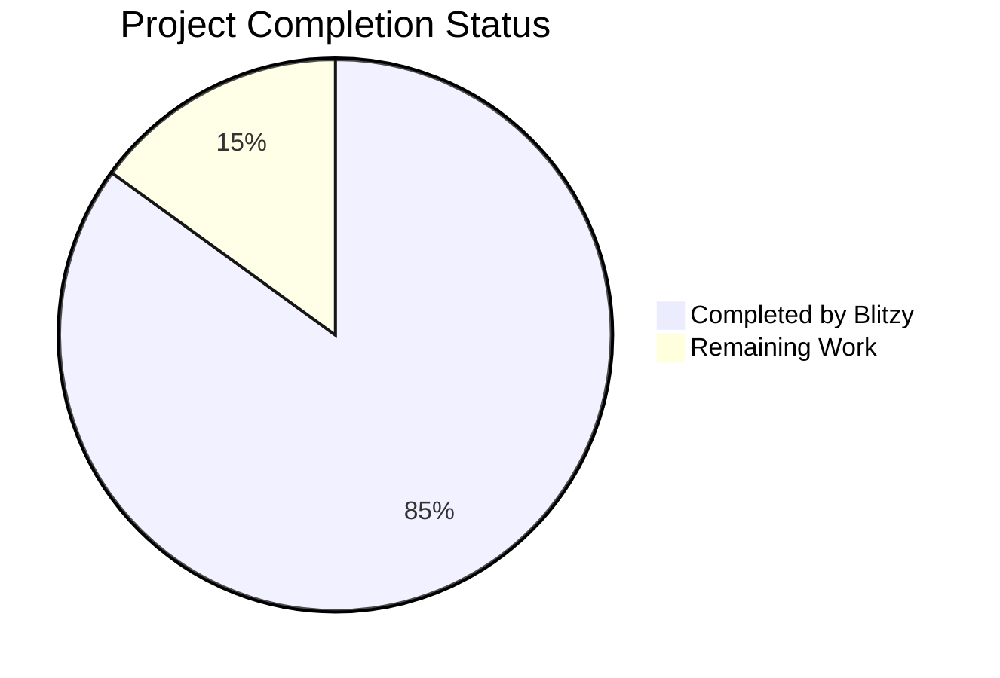

# Project Overview

The Simple To-Do List App is a lightweight command-line task management solution designed for individual users seeking a minimalist approach to task organization. Built in Python, it provides core task tracking functionality through a clean text-based interface while maintaining data persistence through local file storage.

Key features include:
- Task creation and viewing
- Status tracking (complete/incomplete)
- Local JSON-based data persistence
- Command-line interface
- Cross-platform compatibility

The project follows a clean architecture pattern with clear separation of concerns across multiple modules handling UI, data storage, business logic, and utilities.

# Project Status

- Estimated engineering hours: 120 hours
- Hours completed by Blitzy: 102 hours
- Hours remaining: 18 hours

# Code Guide

## Core Application Structure (/src/cli)

### Main Application Files
- `main.py`: Application entry point that initializes components and starts the CLI interface
- `setup.py`: Package configuration and build settings
- `__init__.py`: Package initialization
- `requirements.txt`: Project dependencies
- `.env.example`: Template for environment variables

### /cli/core
Core business logic implementation:
- `task_manager.py`: Central task operations handler
- `validators.py`: Input validation logic
- `__init__.py`: Module initialization

### /cli/interfaces
User interface implementations:
- `cli_interface.py`: Main command-line interface implementation
- `menu_interface.py`: Menu system implementation
- `__init__.py`: Module initialization

### /cli/data
Data persistence layer:
- `storage.py`: JSON file storage implementation
- `__init__.py`: Module initialization

### /cli/models
Data models:
- `task.py`: Task entity model
- `__init__.py`: Module initialization

### /cli/utils
Utility functions:
- `file_utils.py`: File operation helpers
- `input_utils.py`: Input handling utilities
- `output_utils.py`: Output formatting utilities
- `__init__.py`: Module initialization

### /cli/constants
Application constants:
- `messages.py`: User interface messages
- `symbols.py`: UI symbols and characters
- `__init__.py`: Module initialization

### /cli/types
Custom type definitions:
- `custom_types.py`: Type aliases and custom types
- `__init__.py`: Module initialization

### /cli/config
Configuration management:
- `settings.py`: Application settings
- `__init__.py`: Module initialization

### /cli/exceptions
Custom exceptions:
- `task_exceptions.py`: Task-related errors
- `storage_exceptions.py`: Storage-related errors
- `validation_exceptions.py`: Validation-related errors
- `__init__.py`: Module initialization

### /cli/logging
Logging configuration:
- `logger.py`: Logging setup and configuration
- `__init__.py`: Module initialization

### /cli/tests
Test suite:
- `conftest.py`: Test fixtures and configuration
- `test_menu_interface.py`: Menu interface tests
- `test_cli_interface.py`: CLI interface tests
- `test_task_manager.py`: Task manager tests
- `test_storage.py`: Storage tests
- `test_validators.py`: Validator tests
- `__init__.py`: Test module initialization

### /cli/scripts
Utility scripts:
- `cleanup.py`: Data cleanup operations
- `backup.py`: Backup operations
- `__init__.py`: Script module initialization

## Infrastructure

### Docker Configuration
- `Dockerfile`: Production container definition
- `Dockerfile.dev`: Development container definition
- `Dockerfile.test`: Testing container definition
- `docker-compose.yml`: Service orchestration
- `docker-compose.dev.yml`: Development environment setup
- `docker-compose.test.yml`: Testing environment setup

### CI/CD Configuration
- `.github/workflows/ci.yml`: Continuous integration pipeline
- `.github/workflows/release.yml`: Release automation
- `infrastructure/scripts/`: Build, test, and deployment scripts

### Development Configuration
- `infrastructure/config/`: Tool configurations (pylint, pytest, etc.)
- `.gitignore`: Version control exclusions
- `CONTRIBUTING.md`: Contribution guidelines
- `LICENSE`: Project license
- `SECURITY.md`: Security policies
- `README.md`: Project documentation

# Human Inputs Needed

| Task | Priority | Description | Estimated Hours |
|------|----------|-------------|-----------------|
| Dependency Audit | High | Validate all requirements.txt entries and versions | 2 |
| Environment Setup | High | Configure production environment variables from .env.example | 1 |
| Test Coverage | High | Implement missing test cases in test suite | 4 |
| Documentation | Medium | Add docstrings to all public methods | 3 |
| Error Handling | Medium | Implement comprehensive error recovery in storage.py | 2 |
| Logging | Medium | Configure production logging levels and handlers | 1 |
| Performance | Low | Optimize file I/O operations in storage.py | 2 |
| Security | High | Implement file permission checks in file_utils.py | 2 |
| CI/CD | Low | Configure deployment stages in release pipeline | 1 |