# Technical Specifications

# 1. INTRODUCTION

## 1.1 Executive Summary

The Simple To-Do List App is a lightweight command-line task management solution designed to help users efficiently track and manage their daily tasks. This application addresses the fundamental need for straightforward task organization without the complexity of feature-rich alternatives. The primary stakeholders include individual users seeking a minimalist task management tool, while the core value proposition lies in its simplicity, speed, and reliability.

The system will enable users to maintain task lists with basic status tracking, providing immediate productivity benefits through a clean, text-based interface that minimizes distractions and maximizes efficiency.

## 1.2 System Overview

### Project Context

| Aspect | Description |
| --- | --- |
| Market Position | Entry-level task management tool |
| Target Segment | Individual users seeking minimal complexity |
| Deployment Model | Standalone command-line application |
| Technology Stack | Python-based implementation |

### High-Level Description

| Component | Details |
| --- | --- |
| User Interface | Command-line menu system |
| Data Storage | Local file-based persistence |
| Task Management | In-memory list structure |
| Status Tracking | Binary completion states |

### Success Criteria

| Metric | Target |
| --- | --- |
| Task Operation Speed | \< 1 second response time |
| Learning Curve | \< 10 minutes to proficiency |
| Data Reliability | 100% task persistence |
| User Satisfaction | Minimal command complexity |

## 1.3 Scope

### In-Scope Elements

#### Core Features

| Feature | Description |
| --- | --- |
| Task Creation | Text-based task entry |
| Task Viewing | Numbered list display |
| Status Updates | Completion marking |
| Data Persistence | Local file storage |

#### Implementation Boundaries

| Boundary | Specification |
| --- | --- |
| User Base | Single user per installation |
| Platform Support | Cross-platform CLI environments |
| Data Storage | Local file system only |
| Interface | Text-based interactions |

### Out-of-Scope Elements

- Graphical user interface
- Multi-user support
- Network connectivity
- Task categorization
- Due dates and reminders
- Priority levels
- Recurring tasks
- Mobile device support
- Cloud synchronization
- Task sharing capabilities
- Advanced search functionality
- Data analytics
- Integration with external calendars
- Email notifications
- Task dependencies

# 2. SYSTEM ARCHITECTURE

## 2.1 High-Level Architecture

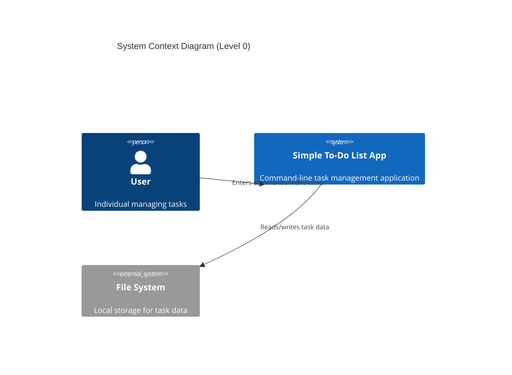

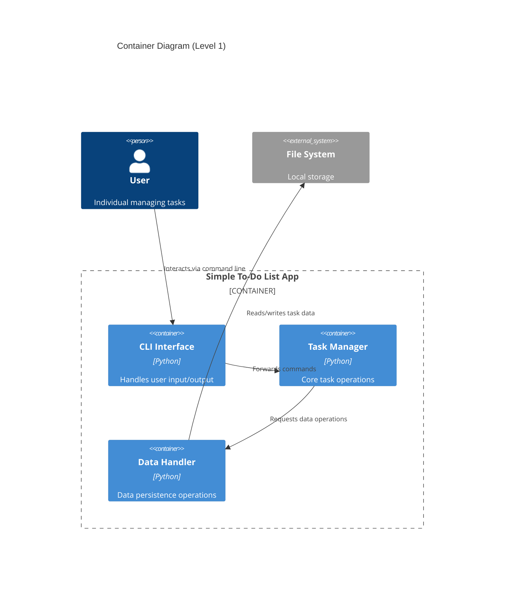

## 2.2 Component Details

### 2.2.1 Core Components

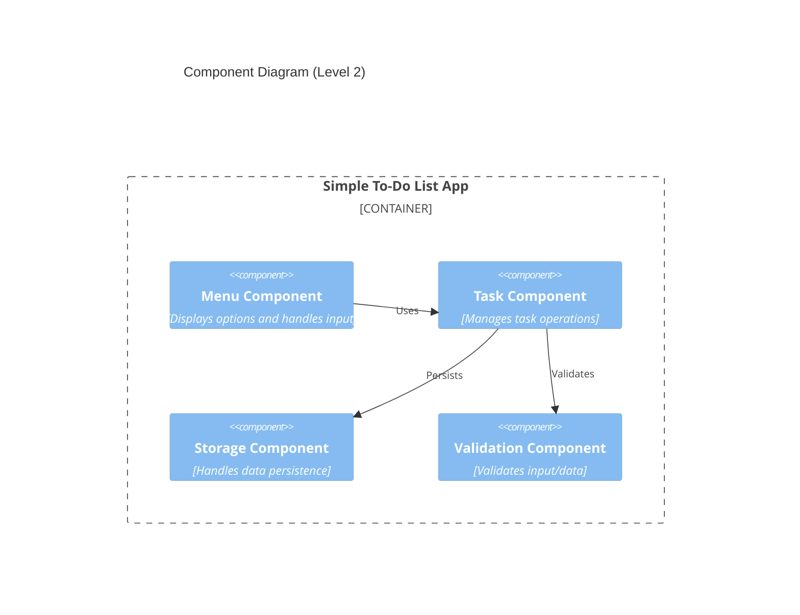

| Component | Purpose | Technology | Interfaces | Data Requirements |
| --- | --- | --- | --- | --- |
| Menu Component | User interaction | Python stdlib | Command input/output | N/A |
| Task Component | Task operations | Python collections | Task CRUD operations | In-memory list |
| Storage Component | Data persistence | Python file I/O | File read/write | Local file access |
| Validation Component | Input validation | Python stdlib | Validation methods | N/A |

### 2.2.2 Data Flow

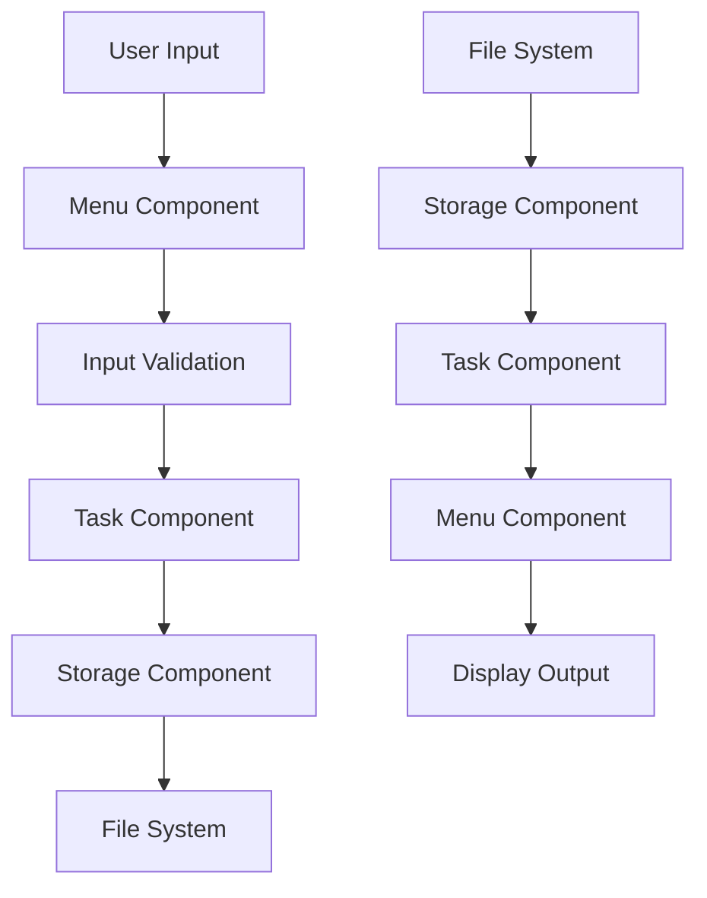

## 2.3 Technical Decisions

### 2.3.1 Architecture Choices

| Decision | Choice | Rationale |
| --- | --- | --- |
| Architecture Style | Monolithic | Simplicity, single-user focus |
| Communication | Synchronous | Direct function calls for simplicity |
| Data Storage | File-based | Local persistence, no database needed |
| State Management | In-memory | Fast access, small data volume |

### 2.3.2 Implementation Strategy

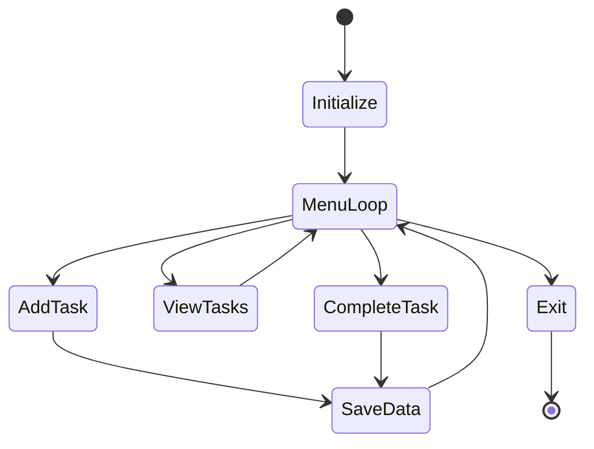

## 2.4 Cross-Cutting Concerns

### 2.4.1 System Operations

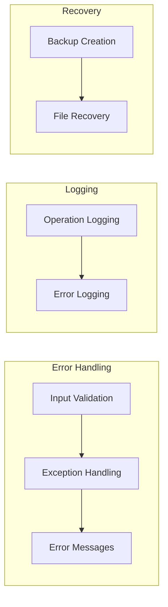

### 2.4.2 Operational Requirements

| Concern | Implementation |
| --- | --- |
| Error Handling | Try-except blocks, user feedback |
| Logging | File-based operation logging |
| Data Integrity | File backups, atomic writes |
| Security | File permissions, input sanitization |
| Recovery | Backup file restoration |

### 2.4.3 Deployment Architecture

```mermaid
deployment
    node "User's Computer" {
        artifact "Python Runtime" {
            artifact "To-Do List App"
        }
        artifact "Local Storage" {
            file "Task Data"
            file "Backup Data"
        }
    }
```

# 3. SYSTEM COMPONENTS ARCHITECTURE

## 3.1 USER INTERFACE DESIGN

### 3.1.1 CLI Design Specifications

| Component | Specification |
| --- | --- |
| Screen Width | 80 characters maximum |
| Menu Depth | Single level |
| Color Support | ANSI colors when available |
| Input Timeout | None |
| Command Prefix | None required |
| Case Sensitivity | Case-insensitive commands |

### 3.1.2 Command Structure

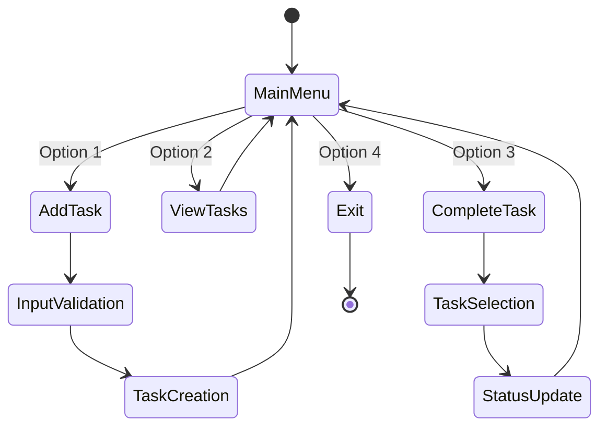

### 3.1.3 Interface Elements

| Element | Format | Validation Rules |
| --- | --- | --- |
| Menu Options | Numbered list (1-4) | Integer between 1-4 |
| Task Input | Single line text | 1-200 characters, no special chars |
| Task Display | `[status] description` | N/A |
| Task Selection | Task number | Integer within task list range |
| Error Messages | `ERROR: message` | N/A |

### 3.1.4 Output Formatting

```
=== Simple To-Do List App ===
1. Add Task
2. View Tasks
3. Mark Task as Complete
4. Exit

Tasks:
1. [ ] Task description
2. [x] Completed task

Enter choice (1-4):
```

### 3.1.5 Help Documentation Structure

| Section | Content |
| --- | --- |
| Usage | Basic command descriptions |
| Examples | Common operation examples |
| Error Reference | List of error messages and solutions |
| Limitations | System constraints and boundaries |

## 3.2 DATA STORAGE DESIGN

### 3.2.1 File Structure

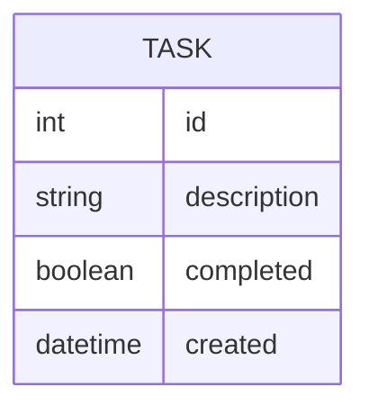

### 3.2.2 Storage Format

| Attribute | Specification |
| --- | --- |
| File Format | JSON |
| File Location | User home directory |
| File Name | todo_tasks.json |
| Backup Name | todo_tasks.json.bak |
| Encoding | UTF-8 |
| Line Endings | Platform-native |

### 3.2.3 Data Management

| Aspect | Implementation |
| --- | --- |
| Versioning | Single file version |
| Backup Frequency | Before each write |
| File Locking | System-level file locks |
| Corruption Detection | JSON validation |
| Maximum Size | 1MB |
| Task Limit | 1000 entries |

### 3.2.4 Storage Operations

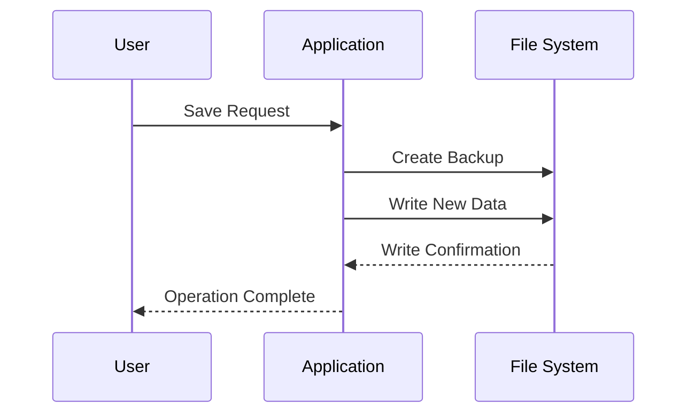

## 3.3 CROSS-CUTTING CONCERNS

### 3.3.1 Error Handling

| Error Type | Handling Strategy |
| --- | --- |
| Invalid Input | Display error, reprompt |
| File Access | Create new if missing |
| Corruption | Restore from backup |
| Memory Error | Graceful shutdown |
| System Error | Log and exit |

### 3.3.2 Data Validation

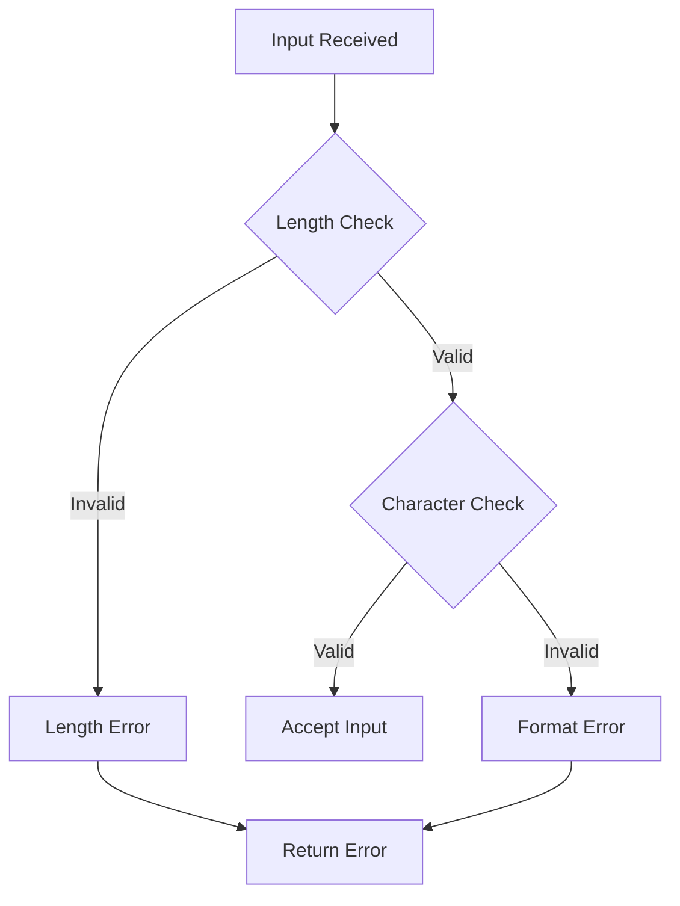

### 3.3.3 Performance Requirements

| Operation | Target Time |
| --- | --- |
| Menu Response | \< 100ms |
| Task Addition | \< 500ms |
| List Display | \< 200ms |
| Status Update | \< 500ms |
| File Operations | \< 1000ms |

### 3.3.4 Security Controls

| Control | Implementation |
| --- | --- |
| File Permissions | 600 (Owner RW) |
| Input Sanitization | Strip special characters |
| Path Validation | Restrict to user directory |
| Memory Clearing | Post-operation cleanup |

# 4. TECHNOLOGY STACK

## 4.1 PROGRAMMING LANGUAGES

| Language | Version | Component | Justification |
| --- | --- | --- | --- |
| Python | 3.6+ | Core Application | - Standard library sufficiency for requirements<br>- Cross-platform compatibility<br>- Simple file I/O operations<br>- Excellent string handling |

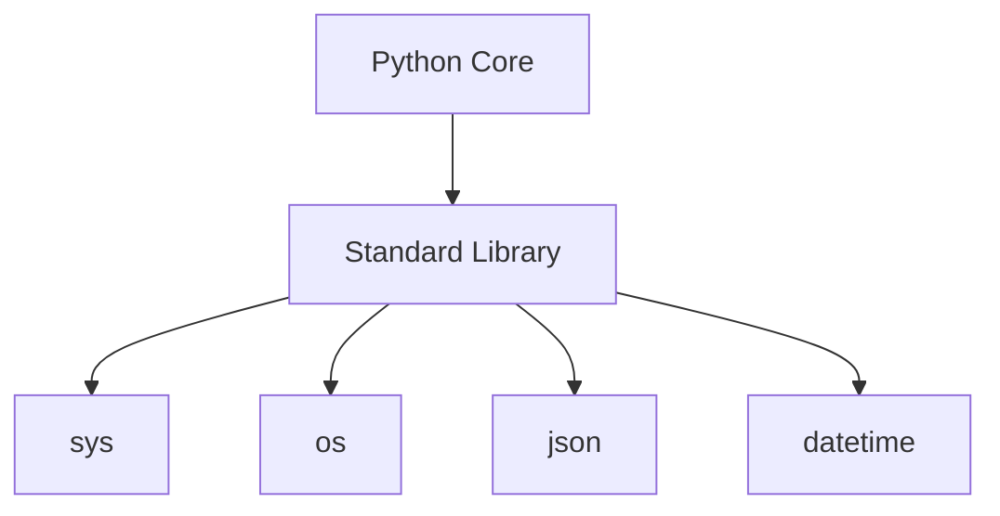

## 4.2 FRAMEWORKS & LIBRARIES

| Component | Library | Version | Purpose |
| --- | --- | --- | --- |
| Core | Python Standard Library | 3.6+ | Base functionality |
| File I/O | builtin open() | N/A | File operations |
| Data Serialization | json | Built-in | Task storage |
| System Interface | os, sys | Built-in | Platform interaction |

### Library Dependencies

```mermaid
flowchart LR
    subgraph Core Libraries
        A[Python Standard Library] --> B[File Operations]
        A --> C[Data Handling]
        A --> D[System Interface]
    end
    
    subgraph Operations
        B --> E[open()]
        C --> F[json]
        D --> G[os/sys]
    end
```

## 4.3 DATABASES & STORAGE

### File-based Storage Strategy

| Aspect | Implementation | Justification |
| --- | --- | --- |
| Primary Storage | Local JSON file | - Simple data structure<br>- Human-readable format<br>- Built-in parsing support |
| Backup Storage | .bak files | - Simple rollback mechanism<br>- No database required |
| Data Format | UTF-8 text | - Universal compatibility<br>- Standard encoding |

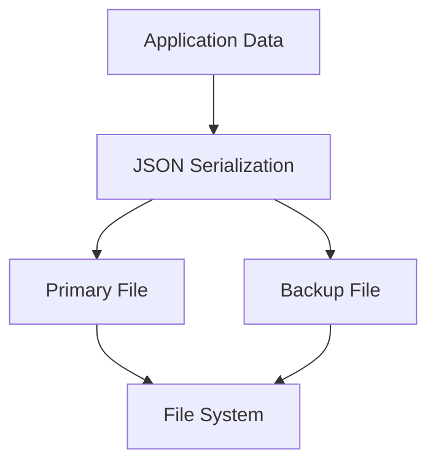

## 4.4 THIRD-PARTY SERVICES

*No third-party services required for this implementation due to:*

- Standalone application architecture
- Local-only operations
- No network connectivity requirements
- Simple data storage needs

## 4.5 DEVELOPMENT & DEPLOYMENT

### Development Tools

| Tool | Purpose | Requirement |
| --- | --- | --- |
| Python Interpreter | Runtime Environment | Python 3.6+ |
| Text Editor | Code Development | Any |
| Command Line | Testing Interface | Terminal Access |

### Deployment Process

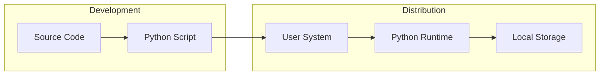

### Build Requirements

| Requirement | Specification | Notes |
| --- | --- | --- |
| Python Version | 3.6 or higher | Standard installation |
| Storage Space | \< 1MB | Application and data |
| Memory | \< 50MB | Runtime requirement |
| OS Support | Cross-platform | Windows/Linux/MacOS |

# 5. SYSTEM DESIGN

## 5.1 USER INTERFACE DESIGN

### 5.1.1 Command Line Interface Layout

```
+----------------------------------+
|     Simple To-Do List App        |
+----------------------------------+
| 1. Add Task                      |
| 2. View Tasks                    |
| 3. Mark Task as Complete         |
| 4. Exit                          |
+----------------------------------+
| Tasks:                           |
| 1. [ ] Example task             |
| 2. [x] Completed task           |
+----------------------------------+
| Enter choice (1-4):              |
+----------------------------------+
```

### 5.1.2 Interface Flow

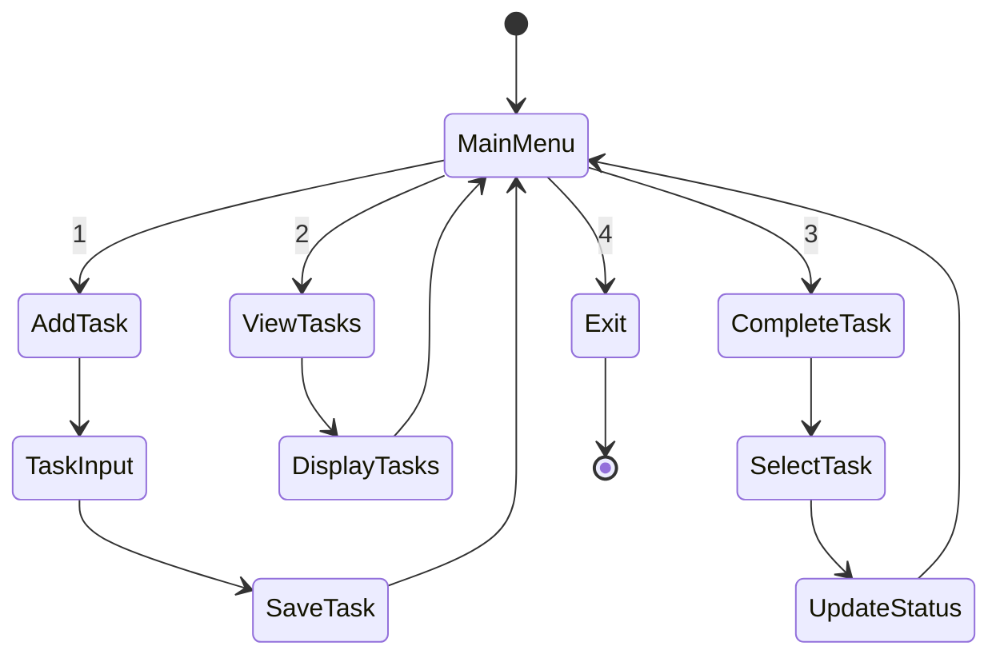

### 5.1.3 Screen States

| Screen | Elements | User Actions | System Response |
| --- | --- | --- | --- |
| Main Menu | - Menu title<br>- 4 numbered options<br>- Input prompt | Numeric input (1-4) | - Validate input<br>- Navigate to selection |
| Add Task | - Input prompt<br>- Current task count | Text input | - Validate length<br>- Create task<br>- Confirm addition |
| View Tasks | - Task list<br>- Status indicators | Press Enter | Return to main menu |
| Complete Task | - Task list<br>- Task number prompt | Numeric input | - Update status<br>- Save changes |

## 5.2 DATA STORAGE DESIGN

### 5.2.1 File Structure

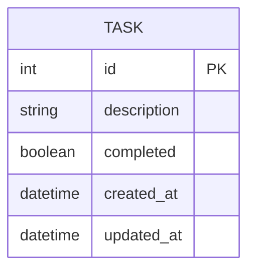

### 5.2.2 Storage Format

```json
{
  "tasks": [
    {
      "id": 1,
      "description": "Example task",
      "completed": false,
      "created_at": "2024-01-01T10:00:00",
      "updated_at": "2024-01-01T10:00:00"
    }
  ],
  "metadata": {
    "last_id": 1,
    "version": "1.0",
    "last_modified": "2024-01-01T10:00:00"
  }
}
```

### 5.2.3 Data Operations

| Operation | Implementation | Error Handling |
| --- | --- | --- |
| Create | Append to tasks array | Duplicate ID check |
| Read | Load entire file | JSON parse validation |
| Update | Modify in memory, save file | Atomic write |
| Delete | Not implemented | N/A |

### 5.2.4 File Management

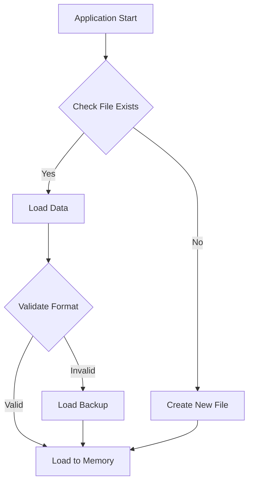

## 5.3 DATA FLOW DESIGN

### 5.3.1 Core Data Flows

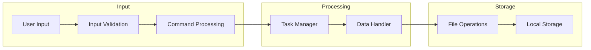

### 5.3.2 Data Transformations

| Stage | Input | Transformation | Output |
| --- | --- | --- | --- |
| Input Capture | Raw string | Sanitization | Clean string |
| Task Creation | Task text | Object creation | Task object |
| Status Update | Task ID | State change | Updated object |
| Storage | Task object | Serialization | JSON string |

### 5.3.3 State Management

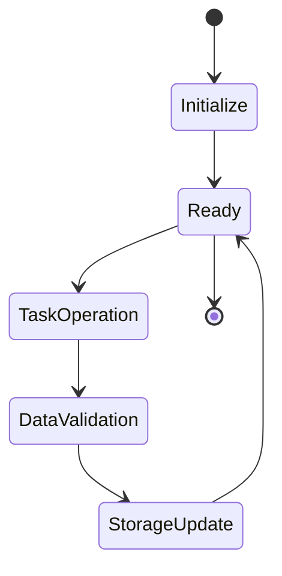

## 5.4 ERROR HANDLING DESIGN

### 5.4.1 Error Categories

| Error Type | Handling Strategy | User Feedback |
| --- | --- | --- |
| Invalid Input | Reprompt | "Invalid input. Please try again." |
| File Access | Use backup | "Restoring from backup..." |
| Data Corruption | Initialize new | "Creating new task list..." |
| System Error | Graceful exit | "Error occurred. Please restart." |

### 5.4.2 Recovery Flow

```mermaid
flowchart TD
    A[Error Detected] --> B{Error Type}
    B -->|Input| C[Show Message]
    B -->|File| D[Backup Check]
    B -->|System| E[Safe Shutdown]
    
    C --> F[Retry Operation]
    D --> G{Backup Exists}
    G -->|Yes| H[Restore Backup]
    G -->|No| I[Initialize New]
    E --> J[Save State]
    
    H --> K[Resume]
    I --> K
    J --> L[Exit]
```

# 6. USER INTERFACE DESIGN

## 6.1 Interface Overview

The Simple To-Do List App uses a text-based command-line interface with consistent layout and navigation patterns. All screens maintain an 80-character width limit and use ASCII characters for visual elements.

### Symbol Key

```
Navigation:
[<] Previous menu    [>] Next menu
[^] Return to main   [v] Show more

Status:
[ ] Unchecked task  [x] Completed task
[!] Error/Warning   [i] Information

Actions:
[+] Add new task    [-] Remove task
[#] Menu options    [=] Settings
```

## 6.2 Main Menu Screen

```
+------------------------------------------------------------------------------+
|                          Simple To-Do List App                                |
+------------------------------------------------------------------------------+
|  [#] MAIN MENU                                                     [?] Help  |
|                                                                              |
|  1. Add Task                                                                 |
|  2. View Tasks                                                               |
|  3. Mark Task as Complete                                                    |
|  4. Exit                                                                     |
|                                                                              |
|  [i] Enter your choice (1-4): [___]                                         |
|                                                                              |
+------------------------------------------------------------------------------+
```

## 6.3 Task List View

```
+------------------------------------------------------------------------------+
|  [<] Main Menu                        TASK LIST                    [?] Help  |
+------------------------------------------------------------------------------+
|                                                                              |
|  Current Tasks:                                                   Page 1/1   |
|                                                                              |
|  1. [ ] Buy groceries                                                       |
|  2. [x] Call dentist                                                        |
|  3. [ ] Write report                                                        |
|  4. [x] Send email                                                          |
|                                                                              |
|  [i] Total Tasks: 4  |  Completed: 2  |  Pending: 2                         |
|                                                                              |
|  Press [Enter] to continue...                                                |
+------------------------------------------------------------------------------+
```

## 6.4 Add Task Screen

```
+------------------------------------------------------------------------------+
|  [<] Main Menu                        ADD TASK                     [?] Help  |
+------------------------------------------------------------------------------+
|                                                                              |
|  Enter task description:                                                     |
|  [....................................................]                      |
|                                                                              |
|  Guidelines:                                                                 |
|  - Maximum 200 characters                                                    |
|  - No special characters                                                     |
|  - Press [Enter] to submit                                                   |
|  - Press [Esc] to cancel                                                     |
|                                                                              |
|  [i] Task will be added with status: [ ] Pending                            |
+------------------------------------------------------------------------------+
```

## 6.5 Complete Task Screen

```
+------------------------------------------------------------------------------+
|  [<] Main Menu                     COMPLETE TASK                   [?] Help  |
+------------------------------------------------------------------------------+
|                                                                              |
|  Select task to mark as complete:                                            |
|                                                                              |
|  1. [ ] Buy groceries                                                       |
|  2. [ ] Write report                                                        |
|                                                                              |
|  Enter task number: [__]                                                     |
|                                                                              |
|  [i] Only pending tasks shown                                                |
|  [!] Press [Esc] to cancel                                                   |
+------------------------------------------------------------------------------+
```

## 6.6 Error Messages

```
+------------------------------------------------------------------------------+
|                               ERROR MESSAGE                                   |
+------------------------------------------------------------------------------+
|                                                                              |
|  [!] Invalid input: Please enter a number between 1-4                        |
|                                                                              |
|  Press [Enter] to continue...                                                |
+------------------------------------------------------------------------------+
```

## 6.7 Help Screen

```
+------------------------------------------------------------------------------+
|  [<] Previous                         HELP                                   |
+------------------------------------------------------------------------------+
|                                                                              |
|  COMMANDS:                                                                   |
|  - Enter numbers 1-4 to select menu options                                  |
|  - Press [Enter] to confirm selections                                       |
|  - Press [Esc] to cancel operations                                          |
|                                                                              |
|  NAVIGATION:                                                                 |
|  [<] Return to previous screen                                               |
|  [^] Return to main menu                                                     |
|                                                                              |
|  STATUS INDICATORS:                                                          |
|  [ ] Pending task                                                            |
|  [x] Completed task                                                          |
|  [!] Error or warning                                                        |
|  [i] Information message                                                     |
|                                                                              |
|  Press [Enter] to return...                                                  |
+------------------------------------------------------------------------------+
```

## 6.8 Screen Flow Diagram

```mermaid
flowchart TD
    A[Main Menu] --> B[Add Task]
    A --> C[View Tasks]
    A --> D[Complete Task]
    A --> E[Exit]
    
    B --> |Save| A
    B --> |Cancel| A
    
    C --> |Return| A
    
    D --> |Complete| A
    D --> |Cancel| A
    
    A --> F[Help]
    F --> A
```

## 6.9 Interface Guidelines

| Element | Format | Validation |
| --- | --- | --- |
| Menu Options | Single digit (1-4) | Integer within range |
| Task Input | Single line text | 1-200 chars, no special chars |
| Task Display | `[status] description` | N/A |
| Error Messages | Centered, bracketed | N/A |
| Navigation | Single key commands | Valid command keys |

# 7. SECURITY CONSIDERATIONS

## 7.1 AUTHENTICATION AND AUTHORIZATION

Since this is a single-user local application, authentication and authorization are handled through operating system file permissions and access controls.

| Security Layer | Implementation | Purpose |
| --- | --- | --- |
| File Access | OS file permissions (600) | Restrict task data access to owner |
| Directory Access | User home directory | Leverage OS user isolation |
| Runtime Access | Single process model | Prevent concurrent access |

```mermaid
flowchart TD
    A[User Access] --> B{OS Authentication}
    B -->|Authorized| C[File System Access]
    B -->|Unauthorized| D[Access Denied]
    C --> E{File Permissions}
    E -->|600| F[Read/Write Access]
    E -->|Other| G[Permission Denied]
```

## 7.2 DATA SECURITY

### 7.2.1 File Security

| Security Measure | Implementation | Protection Level |
| --- | --- | --- |
| File Permissions | Owner read/write only | System-level |
| Storage Location | User home directory | OS-protected |
| Backup Files | Same permissions as primary | System-level |
| File Operations | Atomic writes | Application-level |

### 7.2.2 Data Protection

```mermaid
flowchart LR
    subgraph Data Operations
        A[Input Data] --> B[Sanitization]
        B --> C[Validation]
        C --> D[Memory Storage]
        D --> E[File Write]
    end
    
    subgraph Security Controls
        F[Permission Check] --> E
        G[Path Validation] --> E
        H[Input Cleaning] --> B
    end
```

### 7.2.3 Memory Security

| Measure | Implementation | Purpose |
| --- | --- | --- |
| Memory Clearing | Post-operation cleanup | Prevent data leaks |
| Buffer Management | Fixed-size buffers | Prevent overflows |
| Variable Scope | Minimal exposure | Reduce attack surface |

## 7.3 SECURITY PROTOCOLS

### 7.3.1 File Operation Protocols

```mermaid
sequenceDiagram
    participant U as User
    participant A as Application
    participant F as File System
    
    U->>A: Request File Access
    A->>A: Validate Permissions
    A->>F: Check File Access
    F-->>A: Confirm Access
    A->>F: Create Backup
    A->>F: Perform Operation
    F-->>A: Operation Result
    A->>A: Clear Memory
    A-->>U: Operation Complete
```

### 7.3.2 Input Validation Protocol

| Input Type | Validation Rule | Security Purpose |
| --- | --- | --- |
| Task Text | 1-200 chars, alphanumeric + basic punctuation | Prevent injection |
| Menu Selection | Integer 1-4 | Prevent buffer overflow |
| File Paths | Restricted to user directory | Prevent path traversal |
| Task Numbers | Positive integers within list range | Prevent index attacks |

### 7.3.3 Error Handling Security

| Error Type | Handling Protocol | Security Benefit |
| --- | --- | --- |
| File Access | Generic error messages | Hide system details |
| Input Validation | Sanitized feedback | Prevent information disclosure |
| System Errors | Logged locally | Audit trail |
| Recovery | Use backup files | Data protection |

### 7.3.4 Security Monitoring

```mermaid
flowchart TD
    subgraph Security Events
        A[File Access] --> E[Event Log]
        B[Input Validation] --> E
        C[Permission Checks] --> E
        D[Error Conditions] --> E
    end
    
    subgraph Monitoring
        E --> F[Local Log File]
        F --> G[Size Rotation]
        F --> H[Permission Check]
    end
```

### 7.3.5 Security Configuration

| Setting | Value | Purpose |
| --- | --- | --- |
| File Mode | 0600 | Owner-only access |
| Log Level | ERROR | Minimal disclosure |
| Max Log Size | 1MB | Prevent disk filling |
| Input Timeout | None | Local-only access |
| Backup Retention | 1 version | Minimal exposure |

# 8. INFRASTRUCTURE

## 8.1 DEPLOYMENT ENVIRONMENT

The Simple To-Do List App is designed for local deployment on user workstations, requiring minimal infrastructure.

| Environment Type | Description | Requirements |
| --- | --- | --- |
| Local Machine | User's personal computer | - Python 3.6+<br>- Read/write access to home directory<br>- Terminal/Command Prompt<br>- 50MB available memory |
| Development | Developer workstation | - Python 3.6+<br>- Git<br>- Text editor/IDE<br>- Testing tools |
| Testing | Automated test environment | - Python 3.6+<br>- pytest framework<br>- CI runner |

```mermaid
flowchart TD
    subgraph Local["Local Environment"]
        A[Python Runtime] --> B[Application Code]
        B --> C[Local Storage]
    end
    
    subgraph Dev["Development Environment"]
        D[Source Control] --> E[Development Tools]
        E --> F[Local Testing]
    end
    
    subgraph Test["Test Environment"]
        G[Automated Tests] --> H[Test Reports]
    end
```

## 8.2 CLOUD SERVICES

*Not applicable for this implementation as the application is designed for local deployment only.*

Justification for excluding cloud services:

- Simple local file storage requirements
- No multi-user functionality
- No network connectivity needs
- Cost efficiency for end users
- Data privacy considerations

## 8.3 CONTAINERIZATION

While containerization is not required for end-user deployment, development and testing environments can benefit from containerized setups.

### Development Container Specification

```dockerfile
FROM python:3.6-slim
WORKDIR /app
COPY requirements.txt .
RUN pip install -r requirements.txt
COPY . .
CMD ["python", "main.py"]
```

| Component | Purpose | Configuration |
| --- | --- | --- |
| Base Image | Minimal Python runtime | python:3.6-slim |
| Working Directory | Application files | /app |
| Dependencies | Python packages | requirements.txt |
| Source Code | Application code | Local mount |
| Persistence | Task data storage | Volume mount |

## 8.4 ORCHESTRATION

*Not applicable for this implementation due to:*

- Single-container application
- Local deployment model
- No scaling requirements
- No service discovery needs
- No load balancing requirements

## 8.5 CI/CD PIPELINE

```mermaid
flowchart LR
    subgraph Code["Code Management"]
        A[Git Repository] --> B[Feature Branch]
        B --> C[Pull Request]
    end
    
    subgraph CI["Continuous Integration"]
        C --> D[Automated Tests]
        D --> E[Code Quality]
        E --> F[Build Package]
    end
    
    subgraph CD["Continuous Delivery"]
        F --> G[Release Tag]
        G --> H[Package Distribution]
    end
```

### Pipeline Stages

| Stage | Tools | Actions |
| --- | --- | --- |
| Source Control | Git | - Branch management<br>- Version control<br>- Code review |
| Testing | pytest | - Unit tests<br>- Integration tests<br>- Coverage reports |
| Quality | pylint, black | - Code style checks<br>- Static analysis<br>- Formatting |
| Build | setuptools | - Package creation<br>- Dependency resolution<br>- Version tagging |
| Distribution | PyPI | - Package publishing<br>- Release notes<br>- Documentation updates |

### Automation Configuration

```yaml
name: CI/CD Pipeline

on:
  push:
    branches: [ main ]
  pull_request:
    branches: [ main ]

jobs:
  test:
    runs-on: ubuntu-latest
    steps:
      - uses: actions/checkout@v2
      - name: Set up Python
        uses: actions/setup-python@v2
        with:
          python-version: '3.6'
      - name: Run tests
        run: |
          pip install pytest
          pytest tests/

  quality:
    runs-on: ubuntu-latest
    steps:
      - uses: actions/checkout@v2
      - name: Code quality
        run: |
          pip install pylint black
          black --check .
          pylint src/

  build:
    needs: [test, quality]
    runs-on: ubuntu-latest
    steps:
      - uses: actions/checkout@v2
      - name: Build package
        run: |
          pip install setuptools wheel
          python setup.py sdist bdist_wheel
```

### Deployment Environments

| Environment | Purpose | Deployment Method |
| --- | --- | --- |
| Development | Feature testing | Manual installation |
| Testing | Integration verification | Automated test runner |
| Production | End user distribution | PyPI package manager |

### Release Process

```mermaid
stateDiagram-v2
    [*] --> Feature
    Feature --> Testing: Pull Request
    Testing --> Review: Tests Pass
    Review --> Release: Approved
    Release --> Package: Version Tag
    Package --> Distribution: Build Success
    Distribution --> [*]
```

# 9. APPENDICES

## 9.1 Additional Technical Information

### Development Environment Setup

```mermaid
flowchart TD
    A[Development Setup] --> B[Python Installation]
    B --> C[Version Check]
    C --> D[Directory Setup]
    D --> E[Virtual Environment]
    E --> F[Dependencies]
    
    subgraph Configuration
        G[File Permissions] --> H[Path Setup]
        H --> I[Environment Variables]
    end
    
    F --> Configuration
```

### Error Code Reference

| Error Code | Description | Recovery Action |
| --- | --- | --- |
| E001 | File access denied | Check user permissions |
| E002 | Corrupt data file | Restore from backup |
| E003 | Invalid task number | Re-enter valid number |
| E004 | Memory allocation error | Restart application |
| E005 | Storage limit reached | Remove completed tasks |

### Performance Benchmarks

| Operation | Target Time | Maximum Time | Memory Usage |
| --- | --- | --- | --- |
| Application Start | 500ms | 1000ms | 10MB |
| Task Addition | 100ms | 200ms | +1KB |
| Task List Display | 200ms | 500ms | +5KB per 100 tasks |
| File Save | 300ms | 600ms | +2KB |

## 9.2 GLOSSARY

| Term | Definition |
| --- | --- |
| Atomic Write | File operation that either completes entirely or not at all |
| Backup File | Secondary copy of task data for recovery purposes |
| Command Line | Text-based interface for entering commands |
| Data Persistence | Storage of data that survives program termination |
| Exception Handling | Management of runtime errors in the program |
| File Lock | Mechanism to prevent concurrent file access |
| Input Sanitization | Cleaning user input of potentially harmful characters |
| Memory Footprint | Amount of RAM used by the application |
| Runtime Environment | Software and hardware required to run the application |
| Task Object | Data structure containing task information |
| Transaction Log | Record of operations performed on task data |
| User Directory | Operating system location for user-specific files |
| Validation Rule | Criteria for accepting or rejecting input |
| Virtual Environment | Isolated Python runtime environment |

## 9.3 ACRONYMS

| Acronym | Full Form |
| --- | --- |
| API | Application Programming Interface |
| ASCII | American Standard Code for Information Interchange |
| CLI | Command Line Interface |
| CPU | Central Processing Unit |
| CRUD | Create, Read, Update, Delete |
| CSV | Comma-Separated Values |
| EOF | End Of File |
| GUI | Graphical User Interface |
| I/O | Input/Output |
| IDE | Integrated Development Environment |
| JSON | JavaScript Object Notation |
| KB | Kilobyte |
| MB | Megabyte |
| OS | Operating System |
| PEP | Python Enhancement Proposal |
| PRD | Product Requirements Document |
| RAM | Random Access Memory |
| REPL | Read-Eval-Print Loop |
| SRS | Software Requirements Specification |
| TXT | Text File |
| UI | User Interface |
| UTF-8 | Unicode Transformation Format 8-bit |
| VM | Virtual Machine |

## 9.4 File Format Specifications

```mermaid
erDiagram
    TASK_FILE {
        object metadata
        array tasks
    }
    METADATA {
        string version
        datetime last_modified
        int task_count
    }
    TASK {
        int id
        string description
        string status
        datetime created
        datetime modified
    }
    
    TASK_FILE ||--|| METADATA : contains
    TASK_FILE ||--|{ TASK : contains
```

### Sample JSON Structure

```json
{
  "metadata": {
    "version": "1.0",
    "last_modified": "2024-01-01T12:00:00",
    "task_count": 2
  },
  "tasks": [
    {
      "id": 1,
      "description": "Example task",
      "status": "pending",
      "created": "2024-01-01T10:00:00",
      "modified": "2024-01-01T10:00:00"
    }
  ]
}
```